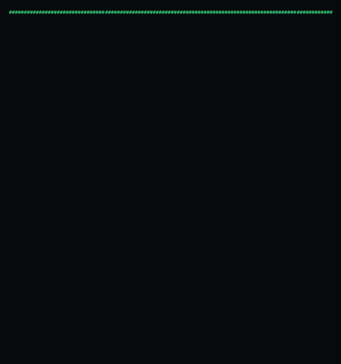

# Hi, I'm Nikhil Gowda S 👋

  

  <b>B.Tech CSE @ VCE Mysuru ('27) | AI/ML Engineer | Building intelligent systems</b>

---

## 🚀 About Me

- 🎓 Final year CSE student with a 9.02 CGPA
- 📍 Based in Mysuru, Karnataka
- 🤖 Interested in AI/ML, LLMs, RAG and intelligent systems
- 💻 Currently strengthening my DSA and software engineering skills

---

## 📌 Featured Projects

### 🏥 MedScribe
LLM-powered medical transcription application built with FastAPI.

[View Repository →](https://github.com/Nikhil-Gowda-S/medscribe1)

### 🎬 Movie Recommender System
Content-based movie recommendation system using cosine similarity.

[View Repository →](https://github.com/Nikhil-Gowda-S/movie_recommender_system)

### 🏏 IPL Win Predictor
Machine learning application that predicts live IPL win probability.

[View Repository →](https://github.com/Nikhil-Gowda-S/ipl-win-predictor)

---

## 📊 GitHub Stats

  
  

---

## 📫 Reach Me

  <a href="https://www.linkedin.com/in/nikhil-gowda-s-597628289">
    LinkedIn
  </a>
  •
  <a href="mailto:nikhilgowdas97@gmail.com">
    Email
  </a>

---

  <i>Building. Learning. Shipping. 🚀</i>

